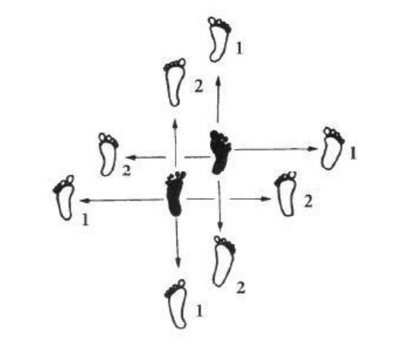
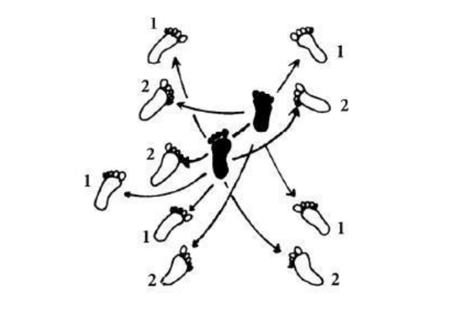
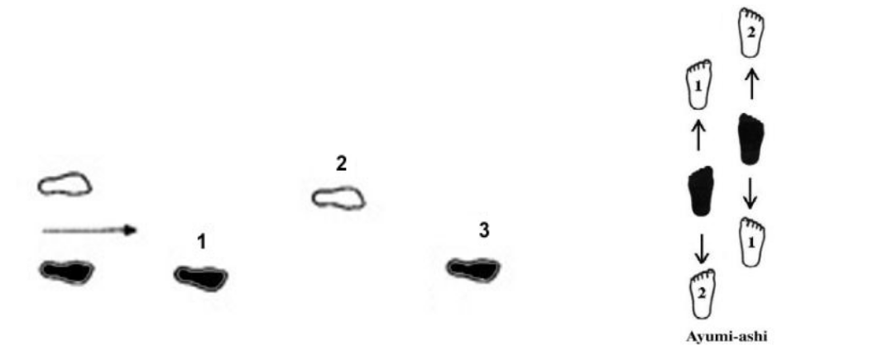
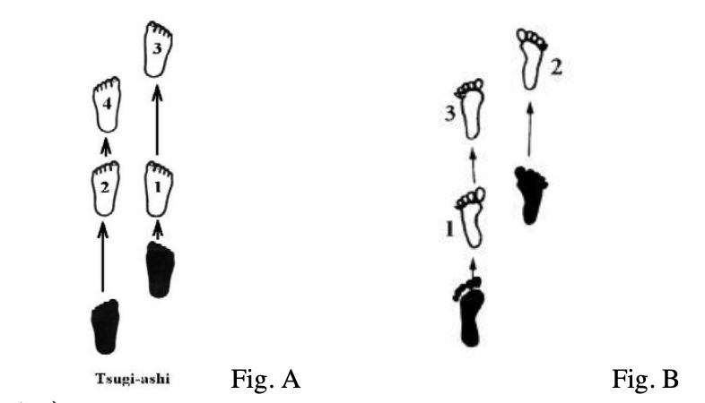

# Ashi-sabaki

Ashi-sabaki is the collective term for all kendo footwork techniques. Ashi-sabaki is the single most important physical aspect of kendo; it is the foundation of all kendo skills. Without good footwork \(without a strong foundation\), it is difficult, if not impossible to build the structures of kendo technique. There are four primary footwork techniques: Okuri-ashi, Hikari-ashi, Ayumi-ashi, and Tsugi-ashi. \(The first 3 are used most frequently.\)

#### Okuri-Ashi

Of the four footwork techniques, okuri-ashi is the principal technique, as it allows coordinated body movement in all directions and can be associated with all kendo techniques. The movement is a simple shuffle step with the foot corresponding to the direction of travel initiating the movement.

#### Hikari-Ashi

Hikira-ashi is a footwork technique applied when a diagonal movement would prove advantageous in avoiding an opponent's attack and open opportunities for a counterattack. Hiraki means "open". As the name implies, this footwork allows a person to step out of the way, opening the path of an advancing opponent, while maintaining correct guard posture of the body and feet.

#### Ayumi-Ashi

Ayumi-ashi is the same as a walking step and is used in situations requiring rapid movement across an extended distance.

#### Tsugi-Ashi

Tsugi-ashi is an advanced footwork technique. It is normally recommend leaving this practice to later in your study \(Shodan +\) as it can lead to bad habits forming in Kihon. Tsugi-ashi is used to move forward quickly across a distance greater than would be possible to cover using okuri-ashi. I was taught \(as older texts describe it\), when practicing tsugi-ashi, it is particularly important to keep in mind the basic rule that the foot corresponding to the direction of movement is advanced first. In other words, the tsugi-ashi technique starts with forward foot advancing first, then followed by the left foot being drawn even with the right to complete the first step of the mvement. Do not move the left foot first - in all circumstances, moving the trail foot first is incorrect and should not be practiced, Fig A. However, I note that some newer texts and more recent instruction have described it as drawing up the left foot parallel with the right, and then immediately steeping forward on the right foot, Fig B. Please discuss this with for coach/sensei before practicing.

#### Suri-ashi \(Sliding step\)

* All ashi-sabaki should be learnt and practiced with suri-ashi - sliding step.
* Slide \(actually glide\) your feet across the floor without pointing toes up.
* Keeping the heel stlightly raised, and sliding the ball of feet and toes helps slide feet smoothly.
* Do not drag feet; try to make ashi-sabaki smooth and graceful.
* This footwork is ideal for wooden smooth surfaces, but will be difficult on treated anti-slip surfaces.
* If your toes rise, it may be due to the step being to large - try smaller steps.

#### Fumi-kiri and Fumi-komi-ashi \(Lung forward with stamping footwork\)

To execute this footwork correctly is difficult to do, and can take several years to do properly. I have broken the sequence of movements down, and later will describe some practice ideas.

* **Fumi-kiri**: a forceful kick /push off the floor with the leg to begin a "jum" forward.
* **Fumi-kiri-ashi**: the leg/foot which provides force and stability by pushing off the floor, in a forward strike the left leg, in retreat the right leg.
* **Fumi-kiri-dousa**: the motion of pushing off the floor with Fumi-kiri-ashi.
* **Fumi-komi**: a firm stamping step with the forward to stabilise the body.
* **Fumi-komi-ashi**: the foot which stamps on the floor with the entire sole.
* **Fumi-komi-dousa**: the series of motions from stamping, recovery to a stable position by bringing the left foot in after a rapid lunge and accomplished by the continuous body movement forward with Okuri-ashi.

The processes to complete these actions are:

* Without bending the left leg, lunge forward the hips maintaining your posture.
* The right foot should move forward parallel to, and just above the floor - don't points toes upwards.
* Straighten your right leg, causing you to stamp the floor with right foot - feeling of slapping the floor with the foot. Remember, Fumi-komi is to stabilise your body, and the loud stamping slap is the result, not the aim.
* The above action should straight posture and bring hips and left leg/foot up behind the right. \(Similar feeling to when stepping up\) - Again left leg/knee straight.
* The body should naturally want to keep moving forward with its momentum - use okuri-ashi to continue forward movement.
* **Do not cheat**. Since it is hard to reach our training partner with one _fumi-komi,_ people tend to cheat to get closer to their training partner. Common cheating to shorten the distance between you and your training partner is using **tsugi-ashi** and **ayumi-ashi**.

#### Seme-Ashi

This will be mentioned in later chapters. The right foot action is called 'Seme-ashi \(foot used for Seme\) when you move your right foot slightly \(only slightly\) forward, without leaning forward. Have the feeling of pushing right knee, foot and hips forward as if pressing into opponent.

#### Jiku-Ashi

This is the left foot. \(Foot used for supporting the body\) - The left foot must remain planted in the correct position to allow you to push forward and attack immediately. Do not lose the feeling that your left foot, left leg, left hip and left side of the body are connected.

**NB**: _If the distance between your right foor and left foot is to wide from front to rear, or the center of gravity moves forward and backward or from backward to forward, or your upper body leans forward and backward in the Kamae, whilst you are trying to give pressure to each other, inviting to initiate an attack, you will not be able to use both feet as described above._

**Main points for all footwork**:

1. It is **important** that during ashi-sabaki, that you move maintaining your posture. Have the feeling of moving your hips/tanden along, keeping constant eye level.
2. Keeping your posture must prevent back heel touch the floor. During Okuri-ashi make sure left heel does not touch floor when stepping back.
3. Especially during Okuri-ashi, never drag the rear foot - it must "snap" up immediately behind the front foot. **Hiki-tsuke** is the action of immediately drawing / pulling up the back foot.
4. The foot corresponding to the direction of movement is advanced first. For example, when moving forward the forward foot leads the movement. Likewise when moving backward, the back foot leads. When moving left, the left foot leads, etc. This is the general rule for all footwork techniques.
5. The speed and strength of both feet should be synchronous, the trailing foot being drawn back to its correct guard position quickly. This tempo was termed "Inyo-ashi" \(shadow and light foot-movement\) by Miyamoto Musashi. Musashi wrote: "_When you cut, when you retreat, and even when you deflect an attack you step right-left-right-left with Inyo-ashi._"
6. The upper body should remain toned, yet relaxed so the shoulders, arms, and shinai do not sway or bob when moving.

#### **Conditions to avoid**

In the Book of Five Rings, Miyamoto Musashi invalidates three type of footwork methods: Tobi-ashi, Uki-ashi, and Fumi-suyuru.

**Tobi-Ashi \(Jumping foot\)**

This foot movement is exhibited when the lead foot is raised upward upon the execution of a step or strike

**Uki-Ashi \(Floating foot\)**

This foot movement is when one foot is not grounded. This situation occurs when the body weight is not centered between the feet, allowing one foot to move lightly over the floor while the opposite foot bears the body weight.

**Fumi-Suyuru \(Stuck foot\)**

When the feet are inactive - fixed in their position.

