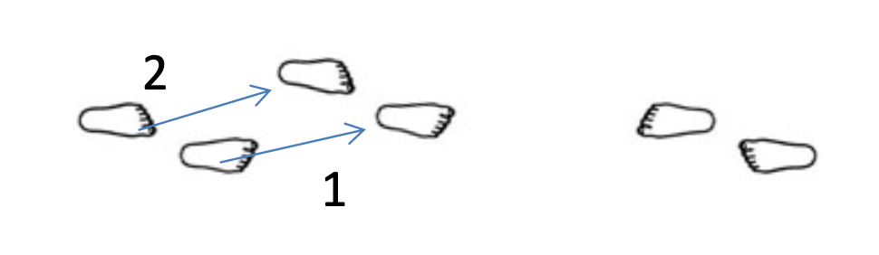
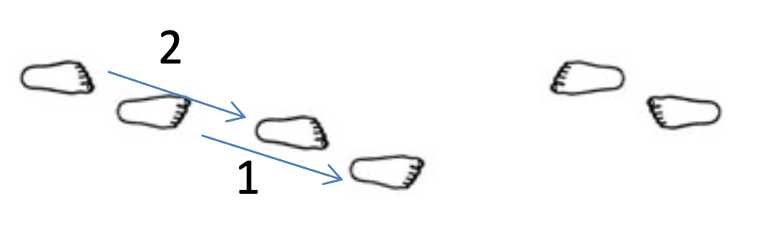
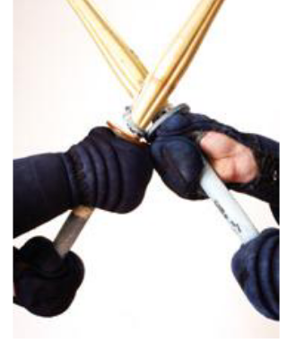

# 間合い、基本の打ち方、突き方、受け方、鍔迫り合い、残心

## 間合い「まあい」

間合い「まあい」 is the spatial distance between you and your opponent. The establishment of 間合い「まあい」 through relationship with the opponent is a subtle and important matter.

1. 近間「ちかま」: closer distance, when you get in further from 一束一刀の間合い, you are in 近間「ちかま」. You can easily reach your opponent but your opponent also can reach you easily.
2. 一束一刀の間合い「いっそくいっとうのまあい」: this distance is a distance where you can reach your opponent with one step forwards and you can avoid your opponent's cut with one step backwards. The fundamental spatial distance in Kendo.
3. 遠間「とおま」: distance beyond 一束一刀の間合い. You cannot reach your opponent and your opponent cannot reach you. Basically your 竹刀 and your opponent's 竹刀 are not touching \(or barely touching\).
4. 打ちま: the distance for you to strike. One's optimum distance and opportunity for striking. When learning, start close to make keeping posture easy, then increase distance - try to be able to strike from as far as possible.

It is easy to strike from 近間; beginners should focus on practicing 稽古「けいこ」 from 遠間「とおま」 to encourage fast 足捌き「あしさばき」 and large fluid striking.

Closing from 遠間「とおま」 is when one must be fully prepared to attack or be attacked - there is no chance to relax.

## 基本の打ち方 - The basic way of striking and 突き方 - Thrusting

We can learn, practice and improve our cutting with 素振り, but we need an opponent to learn about distance and striking effectively.

We should practice striking with 木刀 to just above the target, and striking the target with 竹刀 - either to the Bogu or 竹刀 held close to actual target position, so not to effect cutting distances.

Practicing in pairs, the term かかりて is used for the one striking \(practicing technique\) and 元立ち「もとだち」 used for the receiver of the strike or technique. Both must maintain alertness during practice as both roles are vital.

かかりて must always maintain posture and pressure to be ready to cut immediately any opportunity to strike. The height of the 剣先「けんせん」 in 構えwill vary with the size of one's opponent, as will your 打ちま「うちま」. When in 構え adjust the 剣先「けんせん」 level by moving the left fist position rather than bending the wrist. When cutting your right hand should finish around your opponents shoulder level.

元立ち「もとだち」 must help maintain correct 間合い「まあい」 and provide correct opportunities to be struck.

* Open for 面 by moving 剣先「けんせん」 to your right, or lowering it to the right.
* Open for 小手 by raising the 剣先「けんせん」 to the left - at first, exaggerate movement to make 小手 easy to strike.
* Open for 胴「どう」 by raising arms to reveal target, and sometimes turn body to the right to offer larger target.
* Open for 付「つき」 by lowering 剣先「けんせん」 down to the right - keep chin pulled in to receive.

If not wearing Bogu then use the 竹刀 to receive strikes. Do not hold it arms stretched out as mentioned in the 素振り section as this will effect 間合い「まあい」 - instead hold close to where actual target would be, in such a way you are still protected.

* 面 - hold 竹刀 in both hands just in front and above the head, or with hands in that position, 竹刀 out to your side.
* 小手 - hold 竹刀 in stretched out hands at position 小手 would normally be, or with hands in that position, 竹刀 out to your side.
* 胴「どう」hold 竹刀 in both hands, right hand low down close to your right hip and left hand by right shoulder. The vertical 竹刀 is then in similar position to the 胴「どう」.
* 付「つき」 - not normally practiced by beginners except in style of 木刀二夜剣道基本技稽古保「ぼくとうによるけんどうきほんわざけいこ保」.

First one must master 礼儀 - 構え- 足捌き and 素振り. Then you must learn and develop effective 基本. Keep in mind some important ideas:

* Strike must be with sufficient force to cut with a real sword. Not to soft or too hard - 面 and 胴「どう」 are struck more firmly than the 小手
* You must always keep control of posture and 構え.
* Strikes are not made by force of strength, but bu the correct action of arms and wrists.
* Do not think of striking with the right hand, strike with the left. Do not think of striking with the left hand, but strike with the hips, legs, and feet - use all your body.
* Do not put strength into lifting the 竹刀, relax arms, and strike quickly.

## 基本技

1. Focus on large proper 振り被り「ふりかぶり」, 気合い, and 手の打ち from a stationary position where 打突部位「だとつぶい」 \(striking zones\) can be reached without moving.
2. From 一束一刀の間合い「いっそくいっとうのまあい」, step one step in using 摺足「すりあし」 to strike to add 足捌き「あしさばき」 and 気剣体一致「きてんたいいっち」 practice.
3. From 一束一刀の間合い「いっそくいっとうのまあい」, build up pressure, and then step one step in and strike using 踏み込み足「ふみこみあし」 and 気剣体一致「きてんたいいっち」. Here one learns and improves their 打ちま「うちま」 \(optimism distance and opportunity for cutting\)
4. From a far distance \(遠間「とおま」\), step into 一束一刀の間合い「いっそくいっとうのまあい」 with 摺足「すりあし」, then use sharp 踏み込み「ふみこみ」 to strike and follow through with 残心「ざんしん」.

#### Step 1: Stationary 正面打ち

* From 中段の構え at a distance where 打突部位「だとつぶい」 can be reached without step.
* 振り被り「ふりかぶり」 large swing up until left fist is above forehead.
* 切りつけ: 正面打ち: cut Men with left fist in front of chest; right arm extended and almost parallel to floor, both hands squeeze slightly inward in \(茶巾絞り「ちゃきんしぼり」\) and \(手の打ち\) wrist snap, express sharp loud 気合い: "MEN!"
* Do both actions in one continuous motion \(一挙度「いっきょど」\) - no pause between 振り被り「ふりかぶり」 and 切りつけ：面打ち.

#### Step 2: 送り足正面打ち

* From 中段の構え at a distance of 一束一刀の間合い「いっそくいっとうのまあい」 \(where one step required to reach the target.\)
* One step forward from right with 摺足「すりあし」 as 竹刀 swing up 振り被り「ふりかぶり」 above head as in above practice, and immediately.
* 切りつけ - 面打ち strike as you bright left foot up to proper position behind the right.
* At the moment of striking, express 気合い - "MEN!" or "ICHI!"
* 気合い, 引きつけ \(pulling up left foot\) and strike must be simultaneous - 気剣体一致「きてんたいいっち」.
* Retreat from left foot in one small 送り足 step to show 残心「ざんしん」 in 中段の構え.
* Retreat from left foot, in another small 送り足 steep, to original distance/position, maintaining 中段の構え.

#### Step 3: 踏み込み足正面打ち一束一刀の間合い「いっそくいっとうのまあい」 \(One step cut\)

* From 中段の構え at a distance of 一束一刀の間合い「いっそくいっとうのまあい」 \(where one step required to reach the target - start at easy distance, then try to increase it maintain posture.\)
* When 元立ち \(opponent\) opens their 竹刀 to their right
* 振り被り「ふりかぶり」 swing up 竹刀 above head as in above practice, and immediately.
* Step forward and 切りつけ - 面打ち. Strike Men while stepping decisively forward with the right foot, and expressing 気合い - "MEN!" the step should be large enough to reach the opponent at 一束一刀の間合い「いっそくいっとうのまあい」. When striking, 気合い, stamping 踏み込み足「ふみこみあし」, and strike must be simultaneous - 気剣体一致「きてんたいいっち」.
* Immediately bright the left foot to proper position \(引きつけ\); use quick 送り足 \(摺足「すりあし」\) to protect straight forward; relax hands; keep the arms extended until ready to return to 中段の構え.

_**NB**: Several ways of continuing after cutting which are useful to practice are:_

1. _Continue just 1 step forward and stop at 鍔迫り合い「つばぜりあい」\(see later\) - takes 2 steps back._
2. _Continue straight forward 3-4 steps while 元立ち「もとだち」 retreats - かかりて keeping 竹刀 close to men target. Assume 中段 and reverse roles._

#### Step 4: 攻め➖踏み込み足正面打ち - 遠間「とおま」 \(two step action\)

* From 中段の構え at a distance of 遠間「とおま」 \(where one cannot reach the target in one step - 機先「きさき」 not touching.\) express 気合い \(Yaah!, Aeii!, etc\)
* Take on step into 一束一刀の間合い「いっそくいっとうのまあい」 with 摺足「すりあし」
* Advance right foot/knee/body slightly while maintaining 剣先「けんせん」 position to apply pressure \(攻め足「せめあし」\)
* When 元立ち「もとだち」 \(opponent\) opens their 竹刀 to their right
* Immediately, \(一挙度「いっきょど」 in one motion\) 振り被り「ふりかぶり」 swing up 竹刀 above head as in above practice, 切りつけ - 面打ち strike 面 while stepping decisively forward with the right foot, and expressing 気合い - "Men!" the step should be large enough to reach the opponent at 一束一刀の間合い. When striking, 気合い, stamping 踏み込み足, and strike must be simultaneous - 気剣体一致「きてんたいいっち」.
* Immediately bring the left foot to proper position; use quick successive 送り足「おくりあし」 \(摺足「すりあし」\) to proceed straight forward 3 to 4 fast steps; relax hands; keep the arms extended until ready to turn shortest way towards opponent - steps slow slightly to turn with good posture, with eye contact and return to 中段の構え, at 遠間「とおま」 or 一束一刀の間合い「いっそくいっとうのまあい」 fully ready to attack again.

_**NB**: Several different ways of 元立ち「もとだち」 offering target can be practiced:_

1. _Open immediately after かかりて makes pressure \(攻め\)_
2. _Keep relaxed 構え, and かかりて will "drive" in 攻め to control center line and make opportunity to strike \(気攻め\)_
3. _Wait 2-3 seconds before opening 構え - to teach sensing opportunity._

### _Undesirable habits_

#### 振りー被り「ふりかぶり」

* 剣先 pulled back to soon losing control of the center.
* Eyes looking at target rather the straight ahead into opponents.
* Hands in front of face at 振り被り.
* A stiff left elbow or bending the elbows in.
* Shoulders rise or hunch.
* Head "ducks" under arms, nodding action.
* 竹刀 up angled to the right due to excess strength in the right arm or hand.
* 剣先 drops in the back below hand level during 振り被り.

#### 踏み込み「ふみこみ」、切りつけ、斬新「ざんしん」

* A pause after 振り被り and before 切りつけ.
* Insufficient 気合い.
* Not moving straight forward.
* Hips not square to opponent.
* Right arm low.
* Left elbow bent.
* Left fist too high.
* 竹刀 swings down in an angle due to excess strength in the right arm or hand.
* Striking too hard or too softly or without snap.
* Raising 竹刀 above your head after striking.
* Dropping hands to make 唾競り合い「つばれりあい」to soon.
* Turns away from opponent too soon or runs around them.
* Turns too soon while passing opponent or runs too far from opponent.
* Turns wrong direction \(away from them\)
* Turns with hands and shinai still extended forward.

After understanding the fundamentals of 面打ち「めんうち」, progression onto the other strikes and thrusts can be made using the same basic practice method.

## 小手打ち

* As in 面打ち, a straight large 振り被り and 足被り.
* From 中段の構え the distance where one step required to reach the target is different to 面打ち as the 小手 is held forward of body. Adjust your 打ち間合い and the size of the step appropriately.
* Looking at the opponent's eyes, strike the 小手 straight with both arms naturally extended. Say "小手！".
* Keep 剣先　directed to the opponent and bring left foot up behind right immediately \(引きつけ\).
* Use quick 送り足「おくりあし」to proceed straight forward and stop at 鍔迫り合い「つばぜりあい」.

**NB**: In some exercises, \(such as using 打ち込み「うちこみ」\) run straight pass 元立ち「もとだち」for 残心, and turn to the right at correct 間合い. Most, not all, text books and 先生 teach to always to take 鍔迫り合い「つばぜりあい」after 小手打ち.

_Normally the 元立ち should make a clear opening that is easy to strike. However in some exercise they may keep a passive 構え. In this case it is only possible to strike the 小手 cleanly by either displacing the 剣先 using a push-release technique or 払い技「はらいわざ」or to change ones body center. Adjusting the foot work allows clean striking of the 小手 as soon as 剣先 rises._

* During forward step, position your RIGHT foot in front of opponent's right foot, with hips and body facing them directly.

### Undesirable habits

* 竹刀 swings down in an angle.
* Eyes look to 小手 before striking.
* Left fist too high or to the side.
* Hips bent or twisted.
* Pulls 剣先 away from the opponent after striking.
* Arms not exceed - pulling hands inward to correct incorrect distance.

## 胴打ち（右）「どううちみぎ」

* As in 面打ち, straight large 振り被りand 足捌き.
* Looking at the opponent's eyes.
* Swing the 竹刀 down at a 45 degree angle in front of you keeping the left first/thumb centered and below level of right fist \(with opponent same size\).
* Strike the 胴「どう」straight in front with both arms naturally extended, say "どう！”.
* Bring left foot up behind right immediately \(引きつけ）
* Use quick successive 送り足「おくりあし」to proceed straight forward 3 to 4 fast steps for 残心.

**NB**: Begin by cutting straight ahead, and passing opponent on your right side. 元立ち can turn to their right to offer large 胴 area, and allow かかりて to pass. 残心 after passing turn right.

Later,

* Step out to the right so your left foot is in line with opponents left foot on completion of the strike.
* Move quickly past them to your left side with the feeling of "brushing" shoulders. At appropriate distance, turn left for 残心.

### Undesirable habits

* 切りつけ does not start from above the head.
* Eyes look to 胴 before striking.
* 竹刀 strikes with the side take.
* Left fist too high \(竹刀 tips down\) or fist not centered.
* Arms are crossed.
* Hips twisted or leaning forward.

## 突き打ち

* From 中段の構え at the required distance.
* Step in one \(or two from 藤間「とうま」large step from the right without moving or dipping the 剣先）
* Thrust to 付 straight to the 喉「のど」
* Extend both arms naturally without raising them and shout "つき！"
* Bright left foot up to proper position immediately, thrusting hip forward to maintain posture and stability.
* As soon as thrust complete relax 構え and let arm return naturally back into 中段の構え.

### Undesirable habits

* 竹刀 is thrust in an angle because of uneven strengths in both arms or hands.
* Hands too high.
* Hips are twisted.
* かかりて strikes the floor with 剣先 after 突き.

## 受け方「うけかた」\(Basic blocking techniques\)

There are the methods of defending oneself from strikes using the 竹刀 or 木刀. So why do we need to learn these? 剣道 teaches that there is no defense for the sake of defense and it is not 剣道 to just block attacks.

The being said, it is common for beginners in 次稽古「じげいこ」or 竹刀 to block attacks in such a way that they leave other areas open and easy to strike. Usually this is because all they know is to attack, and when under pressure they back of and try to avoid being hit.

By teaching correct 受け方, they should learn the correct posture, use of arms and 竹刀 to block attacks and be in a position where they can immediately attack. these actions will eventually lead onto Oji Waza such as Suriage and Kaeshi Waza.

### 正面打ちの受け方１- Blocking straight strike to head

* Push both fist forwards and up. \(No higher than right hand at opponents throat level.\)
* Take a small step forward, or have feeling of going forwards.
* Block opponents strike in a diagonal direction with left \(おもて）or right \(うら）side of 竹刀（木刀）.
* Immediately return 構え to control the center - begin mentally and physically return to attack.

**NB**: This movement is the principle beginnings of 擦り上げ「すりあげ」

### 正面打ちの受け方２ - Blocking straight strike to head

* Raise hands and 剣先 in response to opponents attack.
* Strike down opponent's 竹刀 in a diagonal direction with left \(おもて）or right \(うら）side of the 竹刀（木刀）
* Immediately return 構え to control the center - being mentally and physically return to attack.

**NB:** This movement is the principle beginnings of 切り落とし「きりおとし」

For blocking attacks to the 左面 and 右面, please return to 切り返し「きりかえし」chapter 7.

### 小手打ちの受け方１

* Push both fist forwards, turning them \(think of using left fist\) slightly right \(also possible to the left\).
* Adjust 構え to maintain correct rear step if required, but with feeling of going forwards.
* Block opponents strike to the right front with a sliding lift using the right （うら）side of 竹刀（木刀）- left （おもて）side can also be used in the other direction.\)
* Immediately return 構え to control the center - being mentally and physically return to attack.

**NB**: This movement is the principle beginnings of 擦り上げ「すりあげ」

### 小手打ちの受け方２

* Push both fist forward left, turning them to the right.
* Receive opponents strike on the left center side area of your shinai.
* Immediately return 構え to control the center - being mentally and physically return to attack.

**NB**: This movement is the principle beginnings of 返し技「かえしわざ」

### 胴打ちの受け方

* Adjust 構え to the diagonal rear left.
* Lift both hands slightly.
* Slap opponent's striking 竹刀 down. \(Feeling of small sharp striking action\)
* Immediately return 構え to control the center - being mentally and physically return to attack.

**NB**: This movement is the principle beginnings of 撃ち落とし技「うちおとしわざ」

### 突きの受け方１

* Push both fists forward, turning them \(think of using left fist\) slightly left.
* Take a small step forward, or have feeling of going forwards.
* Block opponents strike with a sliding lift to the left front with the left （おもて）side of 竹刀（木刀）
* Immediately return 構え to control the center - being mentally and physically return to attack.

**NB**: This movement is the principle of beginnings of 擦り上げ「すりあげ」


The above is not the only ways - The idea of cutting down the attack \(as mention for 面 and 胴 can equally be used for 小手 and 突き, leading to 打ち落とし技「うちおとしわざ」

Always have the feeling of going forward when blocking where I have mentioned moving backward, have the feeling of stepping back left foot to where it would be needed for your 打ち間合い, then block with a feeling of pushing forward. Your 構え must be stable and prepared to attack going forwards.


### 鍔迫り合い「つばぜりあい」

Above, I mentioned moving into 鍔迫り合い. This is the situation in which the distance between opponents is at its closest. Both are holding 竹刀（木刀）titled slightly right with the 唾「つば」locked together, fighting to spoil opponent's posture and gain initiative to attack.

* After striking, move forward quickly with 送り足.
* Do not pull hands down too quickly, but allow hands to come down naturally as you close in. Have the feeling of keeping 竹刀 contact with 面, forcing hands to lower as you close the distance.
* Hands should not be close to the body, but keeps arms forward in a position where you can swing up （振り被り「ふりかぶり」）normally.
* 竹刀 held forward - upward - tilted to the right. Left hand is left of center, right hand to the right - **NB**: left thumb knuckle should be almost centered.
* Blades are locked together by the 唾. \(**NB**: 1. not fists - try using 木刀 to see position. 2. Touch fist to the blade is 反則「はんそく」in 竹刀。

**NB**: After cutting 小手, when moving in quickly after straight strike, raise 剣先 only when needed to avoid touching opponent, and make sure it come to the correct forward right upward position - this will be impossible if cutting at an angle and pulling tip backward after striking.

From this position, 攻め「せめ」by pushing body / hands in, down, right and left to find opportunity to strike （see 聴き技「ききわざ」）. Do not relax, keep alert and show 残心, being ready to attack at once.

### 残心

The body posture and state of mind in which, even after striking, one is alert and ready to respond instantly to any counter attack by your opponent.

残心 is the state in which, after striking with full power and without hesitation, one faces the opponent with full spirit and with the ability to response naturally.

Generally speaking, after striking one should put the proper distance between yourself and the opponent, and face them in 中段の構え ready to attack or response to counter attack.

During 基本 and 稽古「けいこ」, the 元立ち will normally move aside to allow you to move past, straight forwawrd, to the correct distance, where you turn to show 残心 by being able to attack immediately. If they do not move, then do not "run around" them - you must drive forward.

You may force them out of your way, but if not, enter to 鍔迫り合い「つばぜりあい」or perform 体当たり「たいあたり」

If you cannot move the proper distance away from your opponent, such as after 突き attack \( and during 方\), show 残心 by keeping 剣先 centered around the throat area to guard against attack. Only then move back to the correct 間合い.

You must show and train this idea of 残心 during all practices. it is a vital part of yuko-datotu \(valid striking\). In shiai, even a perfect strike will be deemed invalid if you do not display 残心 afterwards.

#### Ways to practice

Some ideas of improving 残心, and instil the actions required are:

* 元立ち to turn and following かかりて as they past. Check that they look, turn correctly, and 構え is in balance to response and attack.
* Try 面ー残心ー面, where, after striking and making distance, かかりて turns and cuts 面 immediately \(元立ち must be in correct place\).
* During 打ち込み「うちこみ」、掛かり「かかり」、次稽古「じげいこ」- follow up after attacks, and try to strike opponent as they turn - this is one of the key opportunities to attack.

