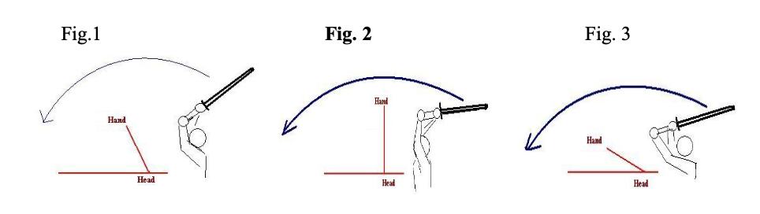

# 素振り

素振り「すぶり」 is the act of swinging the 竹刀 or 木刀 up and down vertically or diagonally. The purpose of 素振り「すぶり」 is to learn how to handle the 竹刀 or 木刀, the correct direction of its movement \(刃筋\), the proper grip for striking, and the basic striking movements related to 足捌き and 体捌き「たいさばき」.

Basic 素振り「すぶり」 are 上下素振り「じょうげすぶり」\(vertical swing\) and 斜め素振り「ななめすぶり」\(diagonal swing\). 区間打突「くかんだとつ」is 素振り「すぶり」 where one practices strike the targets of 面「めん」, 小手「こて」, 胴「どう」, and 付「つき」 to an imaginary opponent.

In the 構え chapter we discussed the correct posture, grip and stance for 中段の構え. To master 素振り「すぶり」, it is essential all these elements are followed correctly. A solid platform is required for correct cutting.

The elements needed for correct 素振り「すぶり」 are:

振り被り「ふりかぶり」 - swing the arms and 竹刀 up above the head. **NB**: The shoulders should be the center of rotation for the swing - avoid bending wrists and elbows inwards.

振り下ろし「ふりおろし」- swing the 竹刀 down from an upward position and strike.

振る「ふる」- to move the 竹刀, continuously up and down or diagonally right and left.

## 上下素振り「じょうげすぶり」

* Starting from the correct 中段の構え position: 

_**NB**: The manuals state that we should swing the 竹刀 without changing the grip. Some sensei suggest moving the right hand close to the left of gripping with both hands together in the center of the 柄「つか」, to make action easier when learning - others say to keep normal grip - do as Instructor asks, but either way - Do NOT allow hands to slide up and down 柄「つか」 during swing - hand position must remain constant._

### **振り被り「ふりかぶり」**

* Swing the 竹刀 upward in a large movement keeping left and right hands perfectly centered.
* The feeling should be of pushing the left hand forwards and up over the head, raising the hands and elbows as far as shoulders will allow. \(DO NOT pull it up with the right hand - this arm must remain relaxed.\) Think of lifting elbows up as far as you can.
* The shoulders are the point the arms and 竹刀 rotate around, the other joints should not move initially.
* Keep the shoulders down and relaxed - do not "hunch" them up during swing.

**NB**: The size of the swing varies with different 先生 ideas. Some say that it should only swing back parallel to the floor, as beyond this requires the other joints to bend. Others state that the swing should go all the way back until the 竹刀 tip reaches the center of your buttocks. The later one is best for beginners / children as it checks the swing is perfectly centered and teaches the correct way to relax and open the shoulder. Therefore this is the method normally practiced.

* Swing the 竹刀 all the way back over your head in a large arc until the 剣先 touches the center of your buttocks.
* You will need to bend / relax your elbows and wrists to do this - Do NOT allow your hand grip to loosen.

### **振り下ろし「ふりおろし」**

* Keep the feeling of rotating the swing around shoulder, allow arms \(elbows and wrists\) to naturally extend during the down swing, while turning wrists slightly inwards, with the feeling of "wringing the 柄側 「つかがわ」" with the bottom 3 fingers - 絞り「しぼり」. Thus, swinging the 竹刀 in a large arc, forward and downwards in a perfectly centered line.
* The swing should finish with the 剣先 at knee level.

### **Important points and common mistakes**

1. The up swing and down swing should be one action, there is no pause or break between the actions \(unless instructed to during certain practice patterns\)
2. Cutting off center is normally a result of the right arm being too stiff, or using it to swing 竹刀.
3. Keep wrist, elbows and shoulders relaxed - do not hunch shoulders.
4. Keep correct posture - do not "duck" or nod head during swing, and keep hips square in front.
5. Do not stick out your left elbow - this is result of wrong 構え / grip and no 絞り「しぼり」 action.

Once you have mastered the basic swing and 送り足「おくりあし」footwork, moving forward/backward and 掛け声「かあけごえ」\(shout\) to 素振り「すぶり」.

* Step forward on the right foot and swing up 竹刀 for 振り被り「ふりかぶり」.
* Immediately swing down 竹刀 and bring up the left foot behind the right - so it is in place at the same moment the swing finishes at knee level - with shout - normally counting, e.g. "いち"
* Step back with the left leg and swing 竹刀 up for 振り被り「ふりかぶり」.
* Immediately swing down 竹刀 and bring back the right foot in front of the left - so it is in place at the same moment the swing finishes at knee level - with shout - normally counting, e.g. "に"
* Repeat sequence 10, 30, 50, 100 times as required to learn it.

## 斜め素振り「ななめすぶり」

斜め素振り「ななめすぶり」 is a progression from 上下素振り「じょうげすぶり」 where the swings are diagonal. Where as 上下素振り「じょうげすぶり」 leads to 面 and 小手 striking, 斜め素振り「ななめすぶり」 is the basis of 左右面「さゆうめん」and 胴「どう」; Most of the exercise should be performed as 上下素振り, with some changes:

* Large swing up until 剣先 reaches between buttocks \(as above\)
* Swing down and squeeze / turn the wrists to the left, so 竹刀 swings down at on a 45 degree angle path from the right.

**NB**: Angle is approximate, and can vary between 30 and 60 degrees, just try to keep consistent.

* With the same 振り下ろし「ふりおろし」 action as before, swing down the 竹刀 until 剣先 is level with left knee.
* Swing the 竹刀 back over your head following the reverse path as swing came down - until 剣先 touches between buttocks.
* Swing down and squeeze / turn the wrists to the right, so 竹刀 swings down at on a 45 degree angle path from the left.
* With the same 振り下ろし「ふりおろし」 action as before, swing down the 竹刀 until 剣先 is level with the right knee.

**IMPORTANT**

* Left hand \(think of left thumb\) must remain in the center body line during entire swing.
* Once you have mastered the basic swing, add 送り足「おくりあし」footwork, moving forward/backward and later 開き足「ひらきあし」 footwork \(moving diagonal sideways\).

## 区間打突「くかんだとつ」

This is 素振り「すぶり」 practice where we imagines cutting a similar sized opponent's target zones of 正面, 右, and 左面, 小手, 右 and 左 do and thrust to 付き「つき」.

I will focus on 正面「しょうめん」 \(straight frontal head cut\) 素振り「すぶり」 - as this fundamental strike must be mastered before you can properly learn any other cuts.

## 正面素振り「しょうめんすぶり」

* Assume 中段の構え - it is essential that your posture, grip and 構え are correct - otherwise it will affect and destroy your 素振り「すぶり」. \(Check 構え in mirror if needed\)

### **振り被り「ふりかぶり」**

* Raise the arms up until the left fist is above the forehead \(at about one fists distance\), 竹刀 is at about a 45 degree angle at least pointing up and back, keeping your head still. **NB**: The shoulders should be the center of rotation for the swing - avoid bending wrists and elbows inwards, feeling of throwing hands and elbow forward and up.
* Instruction: "Raise both elbows as far as they will go" may best describe action.

_Below are some commonly taught 振り被り「ふりかぶり」. Most text books state: "swing up until left fist is above forehead, the 竹刀 at 45-degrees up and back." This would appear to be Fig. 1. Also very common is that seen in figure 3, but I feel this i s more the result of bending elbows or 上段構え - as it is clear that right fist above forehead here. I have also been taught to swing back until shoulder resist movement, and can act like a spring. Further to this, to "swing back as if thrusting into a wall behind you." This would appear to be as seen in Fig. 2._

_From practice, Fig. 2 swing is an extension of Fig 1 that is the arms continue their swing up to their natural limit. As we cannot see behind use when swinging up, this is the point reached in most cases. So maybe the saying "perform a large upward swing with the feeling of 竹刀 being at 45 degrees behind, and left fist above your forehead, use the natural limit of swing to send arms forward to strike." Later, I will include some scientific proof that this method \(Fig. 2\) is the fastest and most efficient action - see Appendix C._

### **振り下ろし「ふりおろし」**

Other terms: 切りつけ「きりつけ」is a cut, and 切り下ろし「きりおろし」is a downwards cut.

* Swing the 竹刀 down from an upward position and strike.
* Have the feeling of pulling left fist down and forward. Remember arms must rotate around the shoulders. Keep right arm relaxed.
* Naturally allow elbows and wrist to stretch forwards.
* Squeeze both hands slightly in, straightening arms - 絞り「しぼり」
* Strike down so 剣先 stops at your head height.
* Do not use strength to strike, but snap wrists forward with "whip" action.
* Right fist just below shoulder level, almost parallel to floor, left fist just below chest level.

When performing 切りつけ（切り下ろし）you must also include:

* 手の内「てのうち」 - this is the overall use of the hands when striking. It includes the way of tightening/loosening of the grip, and the adjusting of the balance between the two hands. 
* 茶巾絞り「ちゃきんしぼり」- the way to grip the 竹刀 with both hands, in posture, or when striking. The term originates from the fact that the way the 竹刀 is gripped when striking resembles the method used to wring out a towel in the tea ceremony. One grips tightly with the little, ring, and middle fingers and loosely with the thumb and forefinger.
* さえ - when striking, the correct coordination of the right and left hand. with instantaneous 手の内, and sharp "whip like" wrist action give the strike the sharpness known as "さえ".

### **"Cut with the left hand, not the right"**

I am sure everyone has heard or been told this. So what does it mean? we hold the sword with two hands, not one, so what is the thought here? After listening to the 先生 I have trained with, I think the following sums up the idea:

The right arm is the forward one and normally the strongest, so there is a tendency to make it do the work. If the right arm is used for pulling up the 竹刀 and cutting, then the action will be incorrect, and will affect your posture. The left hand must pull down and back as the right arms extends forwards to achieve the correct cutting action. By having the **feeling** of the left arm doing 70% of the work, and the right side 30%, they should work in balance.

### **Points to watch and avoid**:

* Pause between 振り被り「ふきかぶり」 and 切りつけ \(NB: Unless practice like 三級度素振り「さんきゅうどすぶり」\)
* Hips are not square to front.
* Head ducks / nods down - keep correct posture.
* Left elbow bent and/or striking out after cutting.
* Left fist finishes to high \(level with right fist\) or to low \(arms not reaching forwards\).
* Using excess strength - stiff right arm or shoulder raise \(hunch\) when cutting.
* No snap action with 剣先.
* 剣先 should not be below level of the hands - maybe sign of incorrect grip or hand position in 構え.
* Not completing cut, but pulling it back upwards without completing action - try pausing.

## 掛け声「かけごえ」 \(shouts\)

掛け声「かけごえ」 is a natural vocalization which shows that one is full of spirit and on guard. It can serve to encourage one's self, to intimidate the opponent, and to announce victory.

The shout is often called 気合い「きあい」, as the shout shows that one's spirit is fully focused on attacking.

Before attacking from 藤間「とうま」\(long distance\), use shouts of "Yah" or "Ei" are often used to increases one's own spirit and to unsettle the opponent.

When attacking we shout the name of the target, "MEN!", showing that you meant to hit where you did, but that you are throwing all of your 気 into the strike. Continue this 気合い「きあい」 until 残心「ざんしん」 is complete. During 素振り「すぶり」 make 気合い「きあい」short and sharp. If counting, shout the numbers.

The shout must be loud and strong - not from your mouth/vocal cords, but from yours abdomen/belly. Close your mouth after you shout.

### **1. Stationary 正面打ち**

* 振り被り「ふりかぶり」: large swing up until left fist is above forehead.
* 切りつけ：正面打ち: left fist is front of chest; right arm extended and almost parallel to floor, both hands \(手の内\) snap and squeeze slightly inward in \(茶巾絞り「ちゃきんしぼり」\), express sharp loud 気合い「きあい」- "MEN!"
* After this, add 送り足「おくりあし」

### **2. 送り足ー正面打ち**

* One step forward from right with 摺足「すりあし」as 竹刀 swing up 振り被り「ふりかぶり」 above head as in above practice - "Ichi"
* 切りつけ：面打ち as you bright left foot up to proper position behind the right \(引き付「ひきつき」\)
* At the moment of striking, express 気合い「きあい」 - "MEN!" or "NI!"
* Retreat from the left foot in one 送り足「おくりあし」 step to original position; assume 中段の構え - "San!"

_NB: The first steps may be altered in order to aid learning principles_

* _Swing up/ 振り被り「ふりかぶり」 - "Ichi"_
* _Step forward from the right, then perform 切りつけ - "MEN"_

Later, do both actions in one continuous motion \(一級度\) - no pause between 振り被り「ふりかぶり」 and 切りつけ - 面打ち.

### **3. 面打ち二級度素振り**

* One step forward from right with 摺足「すりあし」and 竹刀 swing up 振り被り「ふりかぶり」 above head as in above practice, and immediately.
* 切りつけ - 面打ち as you bright left foot up to proper position behind the right.
* At the moment of striking, express 気合い「きあい」- "MEN!" or "ICHI!" etc.
* Retreat from left foot in one 送り足「おくりあし」 step to original position; assume 中段の構え - "NI"

### **4. 連続正面打ち「ぜんぞくしょうめんうち」**

* One step forward from right with 摺足「すりあし」as 竹刀 swing up 振り被り「ふりかぶり」 above head as in above practice, and immediately.
* 切りつけ - 面打ち - as you bright left foot up to proper position behind the right, later motion should be in 一級度 \(one moment, no pause.\)
* At the moment of striking, express 気合い「きあい」- "Men!" or "Ichi!"
* Retreat from left foot 送り足「おくりあし」 step swinging the 竹刀 up with 振り被り「ふりかぶり」.
* 切りつけ - 面打ち as your bright right foot back to the proper position in front of the left, the later motion should be in 一級度 \(one motion, no pause\)
* At the moment of striking, express 気合い「きあい」- "Men!" or "Ni!"

**NB**: Each cut must be with 気合い「きあい」天体一「てんたいいち」- the harmonization of Spirit - Sword - Body when cutting. Coordinate the strike - withdraw of trailing foot - 気合い together.

The above basics can be expanded to include other 素振り「すぶり」, such as:

* 蹲踞素振り「そんきょすぶり」 - cut when rising, 振り被り「ふりかぶり」 as sinking back to 蹲踞「そんきょ」.
* 股割り素振り「またわりすぶり」- feet in wide stance, and cutting as you squat/sink down.
* 左右面素振り「さゆうめんすぶり」cutting to the left and right men.
* 小手面素振り「こてめんすぶり」- practice 連続小手「ぜんぞくこて」and men forwards then back.
* 片手素振り「かたてすぶり」- using only left hand \(best performed against target.\)
* 速素振り「はやすぶり」- using jumping foot work to cut forward and backwards.

Also, as well as practicing alone with 竹刀, they can be practiced:

* In pairs, cutting to a 竹刀 held out in both extended arms at your head level. This is beneficial in teaching feeling of not striking too hard, learning 手の内 and さえ as well as practicing 礼儀 of working together.
* Using 木刀 instead of 竹刀 can be beneficial in the understanding of 刃筋「はすじ」.
* Practicing 素振り「すぶり」 forward and backwards up and down the 道場「どうじょう」 length on one breath to help breathe control and 足捌き.
* Using 開き足「ひらきあし」 or 踏み込み足「ふみこみあし」to learn 足捌き.

