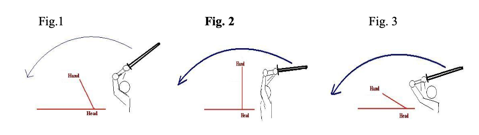

# Suburi

**Suburi** is the act of swinging the shinai or bokuto up and down vertically or diagonally. The purpose of suburi is to learn how to handle the shinai or bokuto, the correct direction of its movement \(**ha-suji**\), the proper grip for striking, and the basic strking movements related to **ashi-sabaki** \(footwork\) and **tai-sabaki**\(body action\).

Basic suburi are **Joge Suburi** \(vertical swing\) and **naname suburi** \(diagonal swing\). **Kukan Datotsu** is suburi where one practices strike the targets of **men**, **kote**, **do**, and **tsuki** to an imaginary opponent.

In the Kamae chapter we discussed the correct posture, grip and stance for Chudan-no-kame. To master suburi, it is essential all these elements are followed correctly. A solit platform is required for correct cutting.

The elements needed for correct suburi are:

**Furi-kaburi** \(furi-kaburu\) - swing the arms and shinai up above the head. **NB**: The shoulders should be the center of rotation for the swing - avoid bending wrists and elbows inwards.

**Furi-oroshi** \(furi-orosu\) - swing the shinai down from an upward position and strike.

**Furu** - to move the shinai, continuously up and down or diagonally right and left.

#### Joge Suburi \(also Joge-buri\)

* Starting from the correct Chudan-no-kamae position: 

_**NB**: The manuals state that we should swing the shinai without changing the grip. Some sensei suggest moving the right hand close to the lef of gripping with both hands together in the center of the tsuka, to make action easier when learning - others say to keep normal grip - do as Instructor asks, but either way - Do NOT allow hands to slide up and down Tsuka during swing - hand position must remain constant._

**Furi-Kaburi**

* Swing the shinai upward in a large movement keeping left and right hands perfectly centered.
* The feeling should be of pushing the left hand forwards and up over the head, raising the hands and elbows as far as shoulders will allow. \(DO NOT pull it up with the right hand - this arm must remain relaxed.\) Think of lifting elbows up as far as you can.
* The shoulders are the point the arms and shinai rotate around, the oter joints should not move initially.
* Keep the shoulders down and relaxed - do not "hunch" them up during swing.

**NB**: The size of the swing varies with different Sensei's ideas. Some say that it should only swing back parallel to the floor, as beyond this requires the other joints to bend. Others state that the swing should go all the way back until the shinai tip reaches the center of your buttocks. The later one is best for beginners / children as it checks the swing is perfectly centered and teaches the correct way to relax and open the shoulder. Therefore this is the method normally practiced.

* Swing the shinai all the way back over your head in a large arc until the kensen touches the center of your buttocks.
* You will need to bend / relax your elbows and wrists to do this - Do NOT allow your hand grip to loosen.

**Furi-Oroshi**

* Keep the feeling of rotating the swing around shoulder, allow arms \(elbows and wrists\) to naturally extend during the down swing, while turning wrists slightly inwards, with the feeling of "wringing the tsuka-gawa" with the bototm 3 fingers - shibori. Thus, swining the shinai in a large arc, forward and downwards in a perfectly centered line.
* The swing should finish with the kensen at knee level.

**Important points and common mistakes**

1. The up swing and down swing should be one action, there is no pause or break between the actions \(unless instructed to during certain practice patterns\)
2. Cutting off center is normally a result of the right arm being to stiff, or using it to swing shinai.
3. Keep wrist, elbows and shoulders relaxed - do not hunch shoulders.
4. Keep correct posture - do not "duck" or nod head during swing, and keep hips square to front.
5. Do not stick out your left elbow - this is result of wrong kamae / grip and no shibori action.

Once you have mastered the basic swing and **Okuri-ashi** footwork, moving forward/backward and Kake-goe \(shout\) to suburi.

* Step forward on the right foot and swing up shinai for furi-kaburi.
* Immediately swing down sihnai and bring up the left foot behind the right - so it is in place at the same moment the swing finishes at knee level - with shout - normally counting, e.g. "ichi"
* Step back with the left leg and swing shinai up for furi-kaburi.
* Immediately swing down shinai and bring back the right foot in front of the left - so it is in place at the same moment the swing finishes at knee level - with shout - normally counting, e.g. "ni"
* Repeat sequence 10, 30, 50, 100 times as required to learn it.

#### Naname Suburi \(Naname-buri\)

Naname suburi is a progression from Joge suburi where the swings are diagonal. Where as Joge suburi leads to Men and Kote striking, Naname-buri is the basis of Sayu Men \(right and left\) and Do; Most of the exercise should be performed as Joge Subutir, with some changes:

* Large swing up until kensen reaches between buttocks \(as above\)
* Swing down and squeeze / turn the wrists to the left, so shinai swings down at on a 45 degree angle path from the right.

**NB**: Angle is approximate, and can vary between 30 and 60 degrees, just try to keep consistent.

* With the same furi-oroshi action as before, swing down the shinai until kensen is level with left knee.
* Swing the shinai back over your head following the reverse path as swing came down - until kensen touches between buttocks.
* Swing down and squeeze / turn the wrists to the right, so shinai swings down at on a 45 degree angle path from the left.
* With the same furi-oroshi action as before, swing down the shinai until kensen is level with the right knee.

**IMPORTANT**

* Left hand \(think of left thumb\) must remain in the center body line during entire swing.
* Once you have mastered the basic swing, add **Okuri-ashi** footwork, moving forward/backward and later **hiraki-ashi** footwork \(moving diagonal sideways\).

#### Kukan Datotsu

This is suburi practice where we imagines cutting a similar sized opponent's target zones of Shomen, Migi, and Hidari men, kote, migi and hidari do and thrust to tsuki.

I will focus on **Shomen** \(straight frontal head cut\) suburi - as this fundamental strike must be mastered before you can properly learn any other cuts.

#### Shomen Suburi

* Assume **Chudan-no-kamae** - it is essential that your posture, grip and kamae are correct - otherwise it will affect and destroy your suburi. \(Check Kamae in mirror if needed\)

**Furi-kaburi**

* Raise the arms up until the left fist is above the forehead \(at about one fists distance\), Shinai is at about a 45 degree angle at least pointing up and back, keeping your head still. **NB**: The shoulders should be the center of rotation for the swing - avoid bending wrists and elbows inwards, feeling of throwing hands and elbow forward and up.
* Instruction: "Raise both elbows as far as they will go" may best describe action.

_Below are some commonly taught Furi-kaburi. Most text books state: "swing up until left fist is above forehead, the shinai at 45-degrees up and back." This would appear to be Fig. 1. Also very common is that seen in figure 3, but I feel this i s more the result of bending elbows or Jodan kamae - as it is clear that right fist above forehead here. I have also been taught to swing back until shoulder resist movement, and can act like a spring. Further to this, to "swing back as if thrusting into a wall behind you." This would appear to be as seen in Fig. 2._

_From practice, Fig. 2 swing is an extension of Fig 1 that is the arms continue their swing up to their natural limit. As we cannot see behind use when swinging up, this is the point reached in most cases. So maybe the saying "perform a large upward swing with the feeling of shinai being at 45 degrees behind, and left fist above your forehead, use the natural limit of swing to send arms forward to strike." Later, I will include some scientific proof that this method \(Fig. 2\) is the fastest and most efficient action - see Appendix C._

**Furi-Oroshi**

Other terms: **Kiritsuke** is a cut, and **Kirioroshi** is a downwards cut.

* Swing the shinai down froom an upward position and strike.
* Have the feeling of pulling left fist down and forward. Remember arms must rotate around the shoulders. Keep right arm relaxed.
* Naturally allow elbows and wrist to stretch forwards.
* Squeeze both hands slightly in, straightening arms - **shibori**
* Strike down so kensen stops at your head height.
* Do not use strngth to strike, but snap wrists forward with "whip" action.
* Right fist just below shoulder level, almost parallel to floor, left fist just below chest level.

When performing **kiri-tsuke** \(kiro-oroshi\) you must also include:

* **Te-no-uchi** 0 this is the overall use of the hands when striking. It includes the way of tightening/loosening of the grip, and the adjusting of the balance between the two hands. 
* **Chakin-shibori** - the way to grip the shinai with both hands, in posture, or when striking. The term originates from the fact that the way the shinai is gripped when strking resembles the method used to wring out a towel in the tea ceremony. One grips tightly with the little, ring, and middle fingers and loosely with the thumb and forefinger.
* **Sae** - when striking, the correct coordination of the right and left ahnds. with instantaneous te-no-uchi, and sharp "whip like" wrist action give the strike the sharpness known as "sae".

**"Cut with the left hand, not the right"**

I am sure everyone has heard or been told this. So what does it mean? we hold the sword with two hands, not one, so what is the thought here? After listening to the Sensei's I have trained with, I think the following sums up the idea:

The right arm is the forward one and normally the strongest, so there is a tendency to make it do the work. If the right arm is used for pulling up the shinai and cutting, then the action will be incorrect, and will affect your posture. The left hand must pull down and back as the right arms extends forwards to acchieve the correct cutting action. By having the **feeling** of the left arm doing 70% of the work, and the right side 30%, they should work in balance.

**Points to watch and avoid**:

* Pause betwen furi-kaburo and kiri-tsuke \(NB: Unless practice like san-kyu-do suburi\)
* Hips are not square to front.
* Head ducks / nods down - keep correct posture.
* Left elbow bent and/or striking out after cutting.
* Left fist finishes to high \(level with right fist\) or to low \(arms not reaching forwards\).
* Using excess strngth - stiff right arm or shoulder raise \(hunch\) when cutting.
* No snap action with kensen.
* Kensen should not be below level of the hands - maybe sign of incorrect grip or hand position in Kamae.
* Not completing cut, but pulling it back upwards without completing action - try pausing.

#### Kake-goe \(shouts\)

**Kake-goe** is a natural vocalization which shows that one is full of spirit and on guard. It can serve to encourage one's self, to intimidate the opponent, and to announce victory.

The shout is often called **ki-ai**, as the shout shows that one's spirit is fully focused on attacking.

Before attacking from toma \(long distance\), use shouts of "Yah" or "Ei" are often used to increases one's own spirit and to unsettle the opponent.

When attacking we shout the name of the target, "MEN!", showing that you meant to hit where you did, but that you are throwing all of your **ki** into the strike. Continue this kiai until Zanshin is complete. During suburi make **ki-ai** short and sharp. If counting, shout the numbers.

The shout must be loud and strong - not from your mouth/vocal cords, but from yours abdomen/belly. Close your mouth after you shout.

**1. Stationary Shomen Uchi** 

* **Furi-kaburi**: large swing up until left fist is above forehead.
* **Kiritsuke: Shomen Uchi**: left fist is front of chest; right arm extended and almost parallel to floor, both hands \(**Te-no-uchi**\) snap and squeeze slightly inward in \(**Chakin-shibori**\), express sharp loud **Ki-ai** - "MEN!"
* After this, add okuri-ashi

**2. Okuri Ashi - Shomen Uchi** \("Men uchi san kyu do suburi"\)

* One step forward from right with **Suri-ashi** as shinai swing up **Furi-kaburi** above head as in above practice - "Ichi"
* **Kiritsuke - Men-uchi** as you bright left foot up to proper position behind the right \(hikitsuki\)
* At the moment of striking, express **Ki-ai** - "MEN!" or "NI!"
* Retreat from the left foot in one **Okuri-ashi** step to original position; assume **Chudan-no-kamae** - "San!"

_NB: The first steps may be altered in order to aid learning principles_

* _Swing up/ furi-kaburi - "Ichi"_
* _Step forward from the right, then perform Kiritsuke - "MEN"_

Later, do both actions in one continuous motion \(Ik-kyo-do\) - no pause betwen Furi-kaburi and Kiritsuke - Men-uchi.

**3. Men uchi Ni Kyu Do Suburi**

* One step forward from right with suri-ashi and shinai swing up furi-kaburi above head as in above practice, and immediately.
* Kiritsuke - Men-uchi as you bright left foot up to proper position behind the right.
* At the moment of striking, express **Ki-ai** - "MEN!" or "ICHI!" etc.
* Retreat from left foot in one Okuri-ashi step to original position; assume **Chudan-no-kamae** - "NI"

**4. Renzuku Shomen Uchi - "Zenshi Kotai Men Suburu"**

* One step forward from right with suri-ashi as shinai swing up furi-kaburi above head as in above practice, and immediately.
* Kiritsuke - Men-uchi - as you bright left foot up to proper position behind the right, later motion should be in Ik-kyo-do \(one moment, no pause.\)
* At the moment of striking, express **Ki-ai** - "Men!" or "Ichi!"
* Retreat from left foot Okuri-ashi step swinging the shinai up with furi-kaburi.
* Kiritsuke -Men-uchi as your bright right foot back to the proper position in front of the left, the later motion should be in Ik-kyo-do \(one motion, no pause\)
* At the moment of striking, express **Ki-ai** - "Men!" or "Ni!"

**NB**: Each cut must be with **ki-ten-tai-itchi** - the harmonization of Spirit - Sword - Body when cutting. Coordinate the strike - widthdraw of trailing foot - kiai together.

The above basics can be expanded to include other suburi, such as:

* Sonkyo suburi - cut when rising, furi-kaburi as sinking back to sonkyo.
* Matawari suburi - feet in wide stance, and cutting as you squat/sink down.
* Saya Men suburi - cutting to the left and right men.
* Kote men suburi - practice renzuku kote and men forwards then back.
* Katate suburi - using only left hand \(best performed against target.\)
* Haya suburi - using jumping foot work to cut forward and backwards.

Also, as weel as practicing alone with shinai, they can be practiced:

* In pairs, cutting to a shinai held out in both extended arms at your head level. This is beneficial in teaching feeling of not striking to hard, learning te-no-uchi and sae, as well as practicing reigi of working together.
* Using Bokuto instead of shinai can be beneficial in the understanding of ha-suji.
* Practicing suburi forward abdn backwards up and down the Dojo length on one breath to help breathe control and ashi-sabaki.
* Using hiraki-ashi or fumi-komi-ashi to learn ashi-sabaki.

