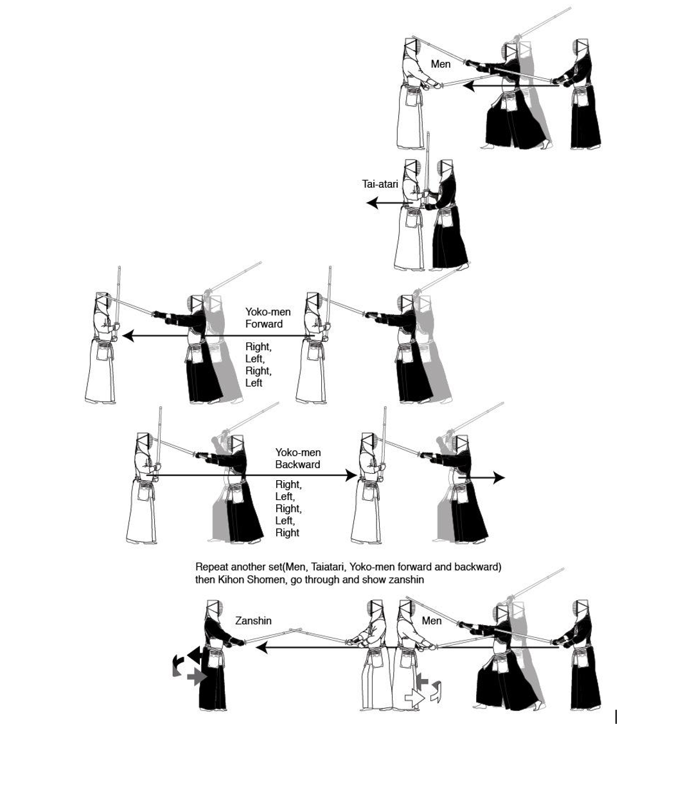

# Kiri kaeshi

Đây là việc tập luyện rất rất quan trọng. Quan trọng đến nỗi bạn phải học trực tiếp từ sensei tại võ đường. Tiếp tục với việc tấn công đầu, người tập ra đòn vào bên trái và bên phải men một cách luân phiên. Việc này không bao giờ được tiến hành qua loa thậm chí đối với những senpai, sensei lâu năm, nó được tập trong tất cả thời gian bạn có. Chỉ một cách đánh nhưng chứa đựng tất cả kỹ thuật bạn được học. Tôi sẽ miêu tả nó một cách chi tiết cho bạn nhưng sẽ không có những hình vẽ cụ thể.Khi được tiến hành chính xác, kiri kaeshi sẽ dần hoàn thiện và nâng cao sức mạnh vật lý, tinh thần , kỹ thuật của bản thân người tập. Lợi ích của Kiri kaeshi mang lại cho người tập kendo  khả năng thách thức với thời gian và khoảng cách \( thời gian: ra đòn nhanh chóng, khoảng cách: tấn công từ rất xa\). Để nâng cao sức chịu đựng và cải tiến kỹ thuật, học cách hít thở chính xác. Ngoài tất cả những điều trên bạn còn phải học thêm taiatari. Trên tất cả đó như một bài tập aerobic.

Từ khoảng cách issoku itto no maai, dùng tiếng thét dữ dội và táo bạo tấn công  shomen. Sau khi áp sát và taiatari \( nhìn hình\),  tiếp tục đưa shinai lên , bắt đầu với men bên trái, tấn công hai bên lần lượt trái và phải 4 lần trong khi đang bước tới, sau đó không dừng lại tấn công 5 lần \( hai bên \)khi đang di chuyển về phía sau.

