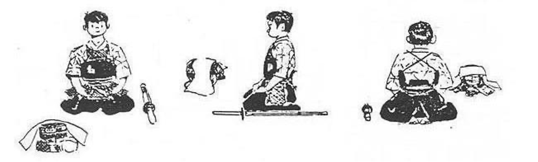

# Seiza

Theo nghĩa đơn giản, seiza chính xác là một tư thế ngồi truyền thống của Nhật. Để có được tư thế này, di chuyển chân trái về phía sau nửa bước, hạ đầu gối chân trái với chân phải theo sau, nhẹ nhàng tựa mông lên hai gót chân. Giữ thẳng lưng\( khí tập trung ở đan điền\) bụng hơi căng một chút. Nếu là nam, Hai đầu gối hướng ra ngoài tạo thành môt chữ V, ngược lại đối với nữ hai đầu gối khép lại.

Bàn tay ngửa ra đặt lên đùi, ánh mắt nhìn thẳng về phía trước tựa như đang hướng tới một ngọn núi xa xăm. Khi đứng dậy, chân phải bước lên trước.Như vậy chân trái sẽ di chuyển ra sau để thực hiện tư thế seiya và chân phải bước ra trước khi đưng dậy.

