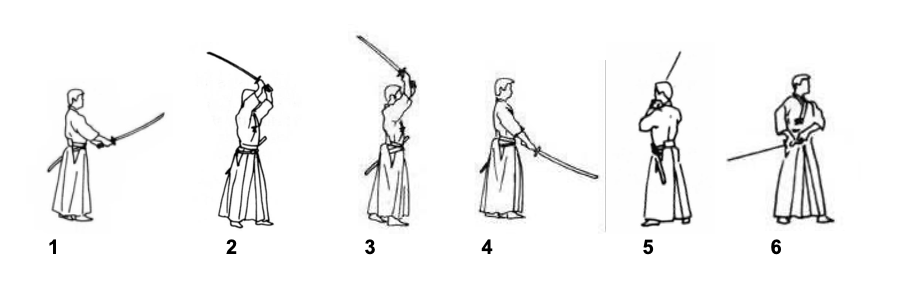
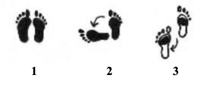
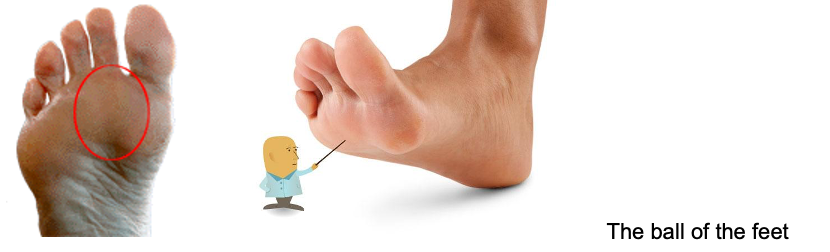

# Thủ thế - Kamae

Kamae là cội nguồn của các đòn tấn công lẫn phòng thủ. Đó dĩ nhiên là thứ quan trọng nhất mà tất cả các kendoka phải học. Kamae theo nghĩa gốc tiếng nhật là tư thế hay dáng dấp , sử dụng trong kendo nhằm diễn tả thế đứng của đôi chân \(chúng ta còn gọi là ashi kamae……….ashi nghĩa là chân\), thế thủ của cơ thể \(biết đến với cái tên Tai kamae… tai chắc các bạn cũng đoán được nghĩa là gì\), và cuối cùng là cách cầm và vị trí của thanh shinai\( Ken kamae\). Nhưng dù vậy ở đây chúng ta chỉ bàn tới thủ thế Chudan \( chudan no kamae- thủ trung đẳng, phân biệt với hạ đẳng và thượng đẳng\), nguyên do có lẽ bởi vì đây là kamae phổ biến nhất trong kendo hiện đại. Kamae được sử dụng với hai mục đích. Ngoài việc mang lại một tư thế phòng thủ vững chắc, gây không ít khó khăn cho địch thủ trong việc tấn công, thì kamae là bước đệm quan trọng mà từ đó các kendoka có thể thực hiện đòn tấn công của mình. Kamae bao gồm ba yếu tố, tât cả chúng cùng được thực hiện một cách hài hòa.

### Tư thế chân

Tư thế chân kamae tốt đem lại cho bạn nền tảng tốt từ đó việc di chuyển ở mọi phương hướng trở nên khá dễ dàng. Trái lại, với tư thế chân tồi, việc di chuyển đến một hay nhiều vi trí trên mặt đất rất khó khăn hoặc thậm chí là không thể. Tư thế chân lý tưởng cũng giúp bạn tức thời tốc biến một cách nhanh chóng khỏi vị trí đang đứng để bắt đầu một đòn tấn công mạnh mẽ và chớp nhoáng.\( thực sự mình chơi League of legend hơi nhiều\)

### Cơ thể

Cơ thể ở một tư thế tốt sẽ duy trì một tâm thái bình tĩnh chưa kể đến giảm mức độ mệt mỏi vật lý của cơ bắp, trong khi đang đối mặt và quan sát đối nhất cử nhất động của đối phương. Một tư thế sai của cơ thể có thể dẫn đến sự mất thoải mái, điều này cuối cùng sẽ làm sao lãng sự tập trung của ban khỏi điểm yếu nhất thời của đối phương\(tuột mất cơ hội quý giá để tấn công\).\(suki\).Tư thế cơ thể tốt đồng thời cũng làm việc vung thanh shinai thành đòn tấn công hoặc lá chắn bảo vệ một cách dễ dàng. Tư thế sai như việc hạ thấp hoặc nhô cao vai sẽ hạn chế hoặc làm chậm sự di chuyển của thanh shinai. Một tư thế đúng sẽ kéo dài đòn tấn công của bạn đối với địch thủ, dù bình thương đòn đánh ấy khó mà tới được.

### Tư thế cầm Shinai

Cách cầm thành shinai chuẩn xác là sự kết hợp giữa việc giữ chặt và đặt hai tay đúng chỗ nhằm kiểm soát vi trí của shinai. Khi ở một tư thế thủ chudan vững chắc, thanh shinai hay kensen luôn luôn nhắm sự đe dọa vào cuống họng địch thủ.Thủ trung đẳng cũng là chìa khóa dẫn tới đòn tấn công hiệu quả nhất. Trong kendo, tất cả các nhát chém đều bắt nguồn từ trung tâm của cơ thể , và tay trái \( đối với người thuận tay phải\) duy trì sự ổn định của cái trung tâm đó. Dĩ nhiên viêc làm kamae, thủ thế, lệch khỏi sự cân bằng sẽ khiến chậm chạp và hạn chế đòn tấn công của bạn bởi vì bạn chỉ có cách duy nhất  là trở lại tư thế đúng trước khi tung ra cú đánh.

### 5 thủ thế trong Kendo

1. Chudan no kamae
2. Jyoge no kamae \(hidari, migi\)
3. Gedan no kamae
4. Hasso no kamae
5. Waki no kamae

### Cách di chuyển

Đối với kendo, di chuyển chân là điều tối quan trọng và trong một vài trường hợp nó thậm chí còn quan trọng hơn các bài tập với tay và kiếm. Thực hiên tốt việc dùng những đôi chân của mình sẽ cho phép các kendoka di chuyển từ vị trí này đến vị trí khác một cách dễ dàng và đẹp mắt, thách thức đối thủ của mình và thực hiện đòn tấn công hiệu quả. Không ngạc nhiên gì nhưng để di chuyển một cách dễ dàng như vậy, điều đầu tiên bạn phải đặt đôi chân mình thật cẩn trọng và vô cùng chính xác. Thế đấy dù các kiếm sỹ di chuyển nhanh nhẹn nhưng họ đều chú ý đến các điều tưởng như vô cùng nhỏ nhặt này.

Với chudan no kamae, người mới tập có thể dễ dàng thực hiện được tư thế đứng chính xác sau một thời gian tập luyện không quá lâu

1. đứng thẳng hai chân,  cả hai gót chân lẫn ngón chân chạm nhau. Đầu gối duỗi thẳng nhưng không quá gò bó cứng nhắc..

2. Xoay chân trái quanh gót chân lúc này chân trái và chân phải tạo thành chữ L \( góc 90 độ\)

3. bây giờ xoay tiếp gót chân trái về phía sau lấy ngón chân trái làm trụ. Như hình vẽ lúc này chân trái phía sau chân phải.

4. Di chuyển trọng lượng lên phần tròn của gan bàn chân \( the ball of the feet\) và giữ cơ thể thăng bằng.

Điều này sẽ khiến cả hai gót chân rời khỏi mặt đất.

5. Uốn cong đầu gối bên trái  vừa phải làm sao cho gót chân lúc này rời khỏi mặt đất với khoảng cách nhỏ, trong khi cả bàn chân phải tiếp xúc với mặt sàn.

6. Giữ hai bàn chân song song.

7. Chân phải ko quá cứng.

8. Chắc chắn trọng lượng cơ thể chia đều lên phần tròn của cả hai chân. Một lỗi rất thường gặp là người tập đặt toàn bộ trọng lượng lên chân phải hoặc chân trái.

9. Bảo đảm rầng sau mỗi bước di chuyển, thì chân trở về tư thế ban đầu \(phải trước, trái sau\)

Những động tác di chuyển này được sử dụng đối với Chudan no Kamae. Học viên mới sẽ phải tập di chuyển với tư thế chân này đến khi nó trở nên dễ dàng và thoải mái.

Nhắc nhở: Nó sẽ mất hàng năm trời.

