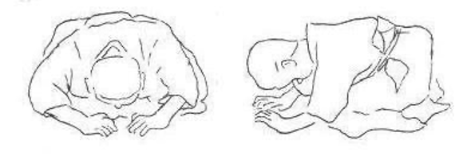

# Zarei

Tư thế cúi đầu khi đang thực hiện seiza, được biết đến với cái tên seiza-ni-rei,. Động tác này được tiến hành theo các bước:

1.     Đặt hai tay lên sàn phía trước đầu gối thành một hình tam giác như hình vẽ.

2.     cả cơ thể cúi sấp nhưng cẩn thận không để phần hông dâng lên cao. Đầu cúi xuống thấp cách tay 6 inch. Chắc chắn việc này nên được thực hiện trong vòng 4 đến 5 giây.

3.     Cuối cùng nhẹ nhàng trở về tư thế seiza như ban đầu.

Toàn bộ các động tác trên  được gọi là zarei, cúi chào khi đang quỳ.

